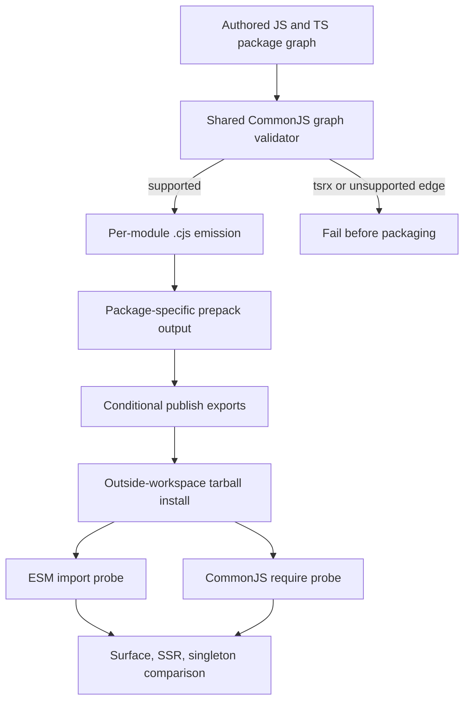

# feat: Add executable CommonJS package conditions

## Goal Capsule

- **Objective:** Add honest, executable CommonJS `require` conditions to the published `octane`, `@octanejs/floating-ui`, `@octanejs/base-ui`, and `@octanejs/radix` runtime roots without weakening their existing ESM/source publication contracts.
- **Authority:** Current repository packaging rules and real packed-consumer behavior outrank manifest shape or workspace-only resolution.
- **Execution profile:** Build shared fail-closed CJS infrastructure, opt the three packages into it, then prove both `import` and `require` from installed tarballs on the supported Node baseline.
- **Stop condition:** Stop rather than advertise `require` if a package cannot produce a real `.cjs` graph, preserves an ESM-only dependency edge, includes authored `.tsrx` that would require publishing compiler output, or exposes a different public runtime surface.
- **Tail ownership:** This prerequisite ships as its own draft PR. The Headless UI binding rebases after merge and reruns its U2 repository-capability audit before broad component work resumes.

---

## Product Contract

### Summary

Octane currently publishes a plain-Node ESM build for core while Floating UI, Base UI, and Radix publish authored TypeScript source. None exposes a root `require` condition that resolves to executable CommonJS. Headless UI's exact-package feasibility gate proved this is repository packaging infrastructure, not adapter behavior. Base UI and Radix also synchronously import `@octanejs/floating-ui`, so that binding is part of the minimum executable CommonJS dependency closure even though the audit names only the three direct capability probes. The prerequisite adds dual-format publication only where it can be proven without compiling or replacing authored `.tsrx` source.

### Problem Frame

An export-map key named `require` is a runtime promise. Pointing it at ESM, TypeScript, a missing prepack artifact, or a wrapper that immediately imports an ESM-only graph would satisfy a static manifest check while failing the consumer. Node chooses conditional exports by condition and treats `.cjs` as CommonJS even inside a `type: module` package, so the honest contract requires a distinct `.cjs` graph plus installed-tarball execution. The existing source-first ESM path remains part of Octane's migration model and must not be replaced by bundled framework output.

### Requirements

**Published contract**

- R1. Published `octane`, `octane/server`, `@octanejs/floating-ui`, `@octanejs/base-ui`, and `@octanejs/radix` runtime exports expose ordered `types`, `import`, `require`, and fallback conditions whose targets exist in their tarballs.
- R2. `require()` selects real `.cjs` entries and executes on Node 22 and 24 without a custom loader, TypeScript runtime, workspace alias, or ESM fallback.
- R3. ESM imports retain the current public entry points, source-first behavior for bindings, and public value/type surfaces.
- R4. Within each separately executed ESM or CommonJS consumer graph, every binding resolves one physical Octane package and one runtime instance, and the two formats expose equivalent required public value subsets. Loading both formats into one process and unifying their module-instance identity is not claimed.

**Build integrity**

- R5. One reusable, package-agnostic build path emits per-module CJS for authored `.ts` and `.js` graphs while preserving package-relative module structure and external package dependencies.
- R6. The builder fails closed on `.tsrx`, unresolved relative edges, top-level-await or other unsupported CJS syntax, missing declared entry points, path escape, and import/export surface drift.
- R7. Generated CJS artifacts are prepack outputs, not committed source, and package allowlists include exactly the required published artifacts.
- R8. The Octane ESM build and existing compiler/type declarations remain verified; adding CJS cannot weaken current dist import, subpath, or source-publication checks.

**Evidence and adoption**

- R9. An outside-workspace consumer installs real tarballs, executes both `import` and `require` roots and representative server paths in separate processes, compares required exports and observable SSR output, and proves React is absent and one physical Octane runtime is used per process graph.
- R10. User-facing package-condition additions receive patch changesets and generated package/release inventories remain current.
- R11. Beyond the minimum Floating UI to Base UI/Radix dependency closure, no other binding gains a `require` claim in this prerequisite; future packages opt in only when the shared builder and packed evidence can support their authored graph.

### Acceptance Examples

- AE1. Given packed Octane, Floating UI, Base UI, and Radix tarballs installed outside the workspace, when a CommonJS program calls `require()` for each runtime root, then Node selects existing `.cjs` files and the expected public functions execute without React or a transpilation loader. Covers R1-R4, R9.
- AE2. Given the same install, when separate ESM and CommonJS programs render representative Base UI and Radix components through Octane server APIs, then both produce the same observable markup and each process resolves one physical Octane runtime. Covers R3-R4, R9.
- AE3. Given a fixture package whose reachable graph contains `.tsrx` or an unsupported CJS construct, when the shared builder runs, then it exits nonzero before a `require` condition can be published. Covers R5-R7, R11.
- AE4. Given a stale or missing CJS export target, when package validation and pack checks run, then CI reports the exact package/subpath/condition rather than accepting the manifest. Covers R1-R2, R6-R8.

### Scope Boundaries

- This PR does not make every publishable Octane package dual-format.
- This PR does not publish Octane compiler output for binding `.tsrx` modules or replace authored ESM/source targets.
- This PR does not promise synchronous `require(esm)` interoperability; it publishes distinct CommonJS artifacts.
- This PR does not make a mixed `import` plus `require` process share one module-instance identity; the release gate proves singleton resolution independently in each format graph.
- This PR does not resume or implement Headless UI component units.
- Browser bundler compatibility beyond the existing ESM/client/server gates is unchanged; the new direct execution contract is Node CommonJS.

---

## Planning Contract

### Key Technical Decisions

- KTD1. **Use explicit dual artifacts, not ESM interop shortcuts.** Published conditions point `import` at the existing ESM/source target and `require` at `.cjs`; the repository never relies on Node synchronously loading the ESM branch.
- KTD2. **Keep the builder opt-in and graph-gated.** The shared build utility supports JS/TS-only package graphs and rejects `.tsrx` or unsupported constructs so one prerequisite cannot silently change the distribution model of all bindings.
- KTD3. **Emit per module without bundling package dependencies.** Preserving module structure, package boundaries, and external dependencies makes CommonJS resolution auditable and avoids hiding duplicate Octane runtimes inside bundles.
- KTD4. **Treat tarballs as the release oracle.** Workspace manifests and generated output are intermediate; installed `npm pack` artifacts must select, execute, and compare both conditions.
- KTD5. **Prove the complete dependency closure behind the three Headless U2 probes.** Core validates mixed TS/JS dual publication; Floating UI validates the transitive binding seam; Base UI and Radix validate the consuming binding path and unlock the exact prerequisite check after the Headless branch rebases.

### High-Level Technical Design

### Sequencing

The shared graph validator and emitter land first because package work must not duplicate build logic. Core then exercises the harder mixed TS/JS runtime graph and extends its existing dist verifier. Floating UI opts in before Base UI and Radix because both roots load it synchronously. Installed-tarball parity closes the contract before changesets and generated inventories are finalized.

### Research Grounding

- `packages/octane/scripts/build.mjs` already emits per-file ESM and declarations at prepack time; extend this pipeline rather than introducing a second unrelated package builder.
- `packages/octane/scripts/verify-dist.mjs` owns complete relative-edge, public-export, and plain-Node import validation for core.
- `scripts/check-package-packs.mjs` already discovers every publishable package and installs external consumers; extend this release oracle instead of creating a workspace-only smoke test.
- `scripts/package-pack-canaries.test.mjs` protects the generated consumer fixtures and is the right negative/control boundary for new ESM/CJS probes.
- `packages/floating-ui/package.json`, `packages/base-ui/package.json`, and `packages/radix/package.json` publish authored TypeScript and contain JS/TS-only source graphs. Base UI and Radix import Floating UI synchronously, making all three the minimum binding-side opt-in closure without compiling `.tsrx`.
- Node's package documentation defines conditional `import`/`require` entry points and guarantees `.cjs` is CommonJS inside a `type: module` package: https://nodejs.org/api/packages.html#conditional-exports

---

## Implementation Units

### U1. Add the fail-closed shared CommonJS package builder

- **Goal:** Provide one reusable prepack utility that validates and emits an executable JS/TS-only CommonJS graph.
- **Files:** `scripts/build-package-commonjs.mjs`, `scripts/build-package-commonjs.test.mjs`, root build dependencies only if the existing toolchain cannot supply the required transform.
- **Patterns:** Follow `packages/octane/scripts/build.mjs` for per-module esbuild emission and `packages/octane/scripts/verify-dist.mjs` for explicit graph verification; keep package dependencies external.
- **Approach:** Discover reachable authored modules from declared package entries, reject paths or syntax that cannot preserve the CommonJS promise, emit deterministic `.cjs` paths, and verify every relative `require` target plus declared entry exists. Keep the interface small enough for package-local prepack scripts to call without manifest-only magic.
- **Execution note:** Start with negative fixtures so unsupported `.tsrx`, path escape, missing target, and incompatible syntax demonstrably fail before implementing the successful graph.
- **Test scenarios:** A TS/JS graph with nested and circular relative imports emits and executes; JSON and external dependencies retain their semantics; `.tsrx`, a missing relative module, a path outside the package, a colliding output, and unsupported top-level-await fail with package-relative diagnostics; two valid entry points sharing modules emit one coherent graph; repeated builds remove stale artifacts.
- **Verification:** Focused Node tests execute the emitted fixture with `createRequire`, inspect condition targets, and prove each negative control exits nonzero.

### U2. Publish Octane core as verified ESM and CommonJS

- **Goal:** Extend core's existing publish-time build and export map with a complete executable CommonJS value surface while retaining current ESM and type outputs.
- **Files:** `packages/octane/scripts/build.mjs`, `packages/octane/scripts/verify-dist.mjs`, `packages/octane/package.json`, `packages/octane/tests/public-exports.test.ts`, focused package-condition tests under `packages/octane/tests/` if needed.
- **Patterns:** Preserve the globbed source-module build and `REQUIRED_PUBLIC_VALUE_EXPORTS` additive subset contract; keep type-only JSX runtime exports type-only.
- **Approach:** Emit separate ESM and CJS runtime trees, map the root and server runtime subpath to ordered `types`/`import`/`require`/fallback targets, and teach the dist verifier to execute both formats and compare required public subsets. Keep compiler, Vite, Volar, React-hosted, and type-only JSX subpaths on their existing ESM/type contracts; they are outside the Headless prerequisite and include ESM-specific machinery.
- **Test scenarios:** Root and server select and execute the correct format; compiler, Vite, Volar, React-hosted, and type-only JSX runtime paths retain their current contracts; every emitted CJS relative edge resolves; missing or stale format targets fail; ESM and CJS required root/server export subsets match.
- **Verification:** Core build and dist verification pass in a clean directory, public-export tests cover both conditions, and existing ESM smoke imports remain unchanged.

### U3. Opt Floating UI, Base UI, and Radix into the shared package condition

- **Goal:** Add honest root CommonJS contracts to the minimum JS/TS-only binding dependency closure behind the Headless feasibility audit.
- **Files:** `packages/floating-ui/package.json`, `packages/base-ui/package.json`, `packages/radix/package.json`, minimal package-local prepack entry scripts if required, and package-boundary tests under `packages/floating-ui/tests/`, `packages/base-ui/tests/`, and `packages/radix/tests/`.
- **Patterns:** Preserve authored source files and existing type targets; follow each package's current root and wildcard export shape rather than reducing the public surface.
- **Approach:** Add generated CJS artifacts to the package allowlists and publish-time conditional maps while leaving ESM/default source targets intact. Floating UI lands first; Base UI wildcard subpaths receive matching CommonJS coverage; Radix retains its root-only boundary.
- **Test scenarios:** Floating UI root requires successfully before either consumer is built; Base UI root and representative wildcard subpaths require successfully; Radix root requires successfully; ESM resolution still reaches authored source; no `.tsrx` or React runtime enters any generated graph; a missing wildcard CJS output or ESM-only transitive dependency fails validation; all three bindings resolve their peer to the same installed Octane instance within the CommonJS process.
- **Verification:** Package-focused build, type, SSR, and package-boundary tests pass against source and generated CommonJS entries in dependency order.

### U4. Extend the packed-consumer release gate across both conditions

- **Goal:** Make installed tarballs—not workspace aliases—the executable parity proof for core and the complete three-binding dependency closure.
- **Files:** `scripts/check-package-packs.mjs`, `scripts/package-pack-canaries.mjs`, `scripts/package-pack-canaries.test.mjs`, and focused pack-check tests where existing seams permit isolation.
- **Patterns:** Reuse the existing outside-workspace consumer, archive map, singleton checks, required-export subsets, SSR execution, and React-absence assertions.
- **Approach:** Add paired ESM and CommonJS consumer entry programs that load core, Floating UI, Base UI, and Radix from real archives in separate processes, compare public subsets and representative SSR output, and inspect each installed graph for one Octane and no React. Validate every declared `require` target during tarball inspection.
- **Test scenarios:** Both entry programs execute identical representative markup; each root resolves outside the workspace; CommonJS selects `.cjs` while ESM selects its existing path; deleting a require artifact, swapping a condition target, adding a second Octane, or leaking React makes the gate fail with the owning package named.
- **Verification:** The full package pack check completes from clean archives on the supported Node matrix and its canary tests pin the generated consumer contract.

### U5. Record release impact and prerequisite handoff

- **Goal:** Finish the user-visible packaging change with accurate release metadata and a clear Headless revalidation seam.
- **Files:** `.changeset/*.md`, generated package inventories produced by `pnpm sync`, and package documentation only where consumers need the new `require` contract explained.
- **Patterns:** Patch all affected 0.x packages; do not edit generated inventories by hand.
- **Approach:** Add patch changesets for `octane`, `@octanejs/floating-ui`, `@octanejs/base-ui`, and `@octanejs/radix`, run repository sync, and document that other bindings remain ESM/source-only until they independently satisfy the opt-in gate.
- **Test scenarios:** Changeset status lists exactly the four affected packages; generated inventories are stable on a second sync; the Headless feasibility audit, after rebasing its branch and regenerating capability evidence, can observe its three executable `require` probes without adapter code because their transitive Floating UI dependency is also executable.
- **Verification:** `pnpm sync`, changeset validation, and generated drift checks leave no unexplained diff.

---

## Verification Contract

| Gate | Scope | Evidence |
| --- | --- | --- |
| Shared builder tests | U1 | Successful JS/TS fixture execution plus fail-closed `.tsrx`, path, syntax, collision, and stale-output controls. |
| Core build/dist verification | U2 | Every value-bearing ESM and CJS subpath imports/requires with required public subsets; type-only paths remain non-runtime. |
| Floating UI, Base UI, and Radix focused suites | U3 | Source ESM behavior, generated CommonJS execution, types, SSR, dependency ordering, root/wildcard boundaries, and singleton peer resolution pass. |
| Package pack canaries | U4 | Real archives install outside the workspace; paired ESM/CJS programs execute, render equivalent output, and contain one Octane/no React. |
| Repository release gates | U1-U5 | `pnpm format:check`, `pnpm typecheck`, relevant Vitest/Node projects, `pnpm packages:pack:check`, and `pnpm sync` pass or any intentionally unrun broad gate is disclosed in the draft PR. |
| Draft PR review | U1-U5 | Current-head Cursor/Bugbot feedback is resolved, branch currency is reconciled, and the PR remains draft for maintainer readiness. |

---

## Definition of Done

- The shared builder emits deterministic, executable `.cjs` modules for supported JS/TS graphs and rejects unsupported graphs before packaging.
- Packed `octane`, `@octanejs/floating-ui`, `@octanejs/base-ui`, and `@octanejs/radix` expose existing ESM/source targets plus distinct CommonJS runtime roots whose files exist and execute.
- ESM and CommonJS required public surfaces, representative SSR output, dependency singleton per format graph, and React absence are proven from an outside-workspace tarball install on the supported Node matrix.
- Core's existing ESM, compiler, declaration, public-subpath, and source-publication guarantees remain green.
- Patch changesets and generated inventories are current.
- The isolated branch is committed and pushed, an agent-provenance PR is opened as a draft, and review/CI residuals are surfaced without promoting or merging it.
- Headless UI remains paused until this prerequisite and the Firefox prerequisite merge; its U2 audit must be rerun after rebase rather than treated as satisfied by this branch alone.
